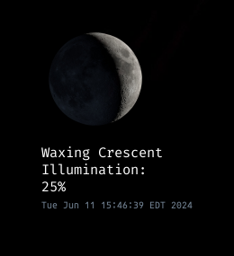

## Moon Phase Image + Label conky
This conky script gets an image from a website and displays it with the current phase of the moon status.



Using ideas from Astro Nerd Conky
https://store.kde.org/p/1957784

I adapted the moon script for FreeBSD use. This script should also work on MacOS. 

```sh
#!/bin/sh

HEMISPHERE="north"
# Define the temporary file location
MOON_DATA_DIR="$HOME/.config/conky/organized/conky_moon/astro_nerd_ripped/tmp/"
MOON_DATA="$MOON_DATA_DIR/moon_data"
TEMP_HTML="$MOON_DATA.html"
TIMESTAMP="$MOON_DATA_DIR/TIMESTAMP"

# Ensure the temporary directory exists
mkdir -p "$MOON_DATA_DIR"

# Fetch the Moon Data from moongiant.com
curl -s "https://www.moongiant.com/phase/today" > "$TEMP_HTML"
curl -s "https://www.moongiant.com" >> "$TEMP_HTML"

# Extract and clean the moon data
sed -n '/<td id="today_">/,/<\/td>/p' "$TEMP_HTML" | \
sed -e 's|.*<td id="today_">||' -e 's|</td>.*||' -e 's|/(.jpg)|\n|g' -e 's/\..*//' \
    -e 's|.*/||' -e 's/<\/b><br>/\n/g' -e 's/<br>/\n/g' -e 's/<br><span>/\n/g' \
    -e 's/<span>/\n/g' -e '2s/\.*<b>//g' -e '2s/^[ \t]*//' > "$MOON_DATA"

# Further clean up the data
sed -i '' '6d;7d' "$MOON_DATA"
sed -i '' -e '6s/,.*//' -e '9s/Full /\n/' "$MOON_DATA"

# Read the image name from the moon data
IMG=$(sed -n 1p "$MOON_DATA")

# Copy the appropriate moon image based on the hemisphere
if [ "$HEMISPHERE" = "south" ]; then
  cp "$HOME/.config/conky/organized/conky_moon/astro_nerd_ripped/south_moon/$IMG.png" "$HOME/.config/conky/organized/conky_moon/astro_nerd_ripped/tmp/current_moon.png"
elif [ "$HEMISPHERE" = "north" ]; then
  cp "$HOME/.config/conky/organized/conky_moon/astro_nerd_ripped/north_moon/$IMG.png" "$HOME/.config/conky/organized/conky_moon/astro_nerd_ripped/tmp/current_moon.png"
fi

# Print timestamp
date >> "$TIMESTAMP"
```