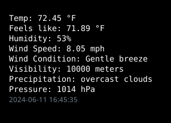

## Weather Conky

Another weather conky that uses OpenWeather.



```php
<?php

// Your OpenWeatherMap API key
$apiKey = "12bd891f73148c66a7521783a5830351";

// City ID
$cityId = '5128581'; // New York City ID

// OpenWeatherMap API URL
//$apiUrl = 'http://api.openweathermap.org/data/2.5/weather?q=' . urlencode($city) . '&appid=' . $apiKey . '&units=imperial';
$apiUrl = 'http://api.openweathermap.org/data/2.5/weather?id=' . $cityId . '&appid=' . $apiKey . '&units=imperial';


// Fetch data from OpenWeatherMap API
$response = file_get_contents($apiUrl);

if ($response === false) {
    echo "Failed to fetch weather data.\n";
} else {
    // Decode JSON response
    $data = json_decode($response, true);

    if (isset($data['main']) && isset($data['wind']) && isset($data['weather'][0]) && isset($data['main']['pressure'])) {
        // Extract weather parameters
        $temperature = isset($data['main']['temp']) ? $data['main']['temp'] : 'N/A';
        $realfeel = isset($data['main']['feels_like']) ? $data['main']['feels_like'] : 'N/A';
        $humidity = isset($data['main']['humidity']) ? $data['main']['humidity'] : 'N/A';
        $windspeed = isset($data['wind']['speed']) ? $data['wind']['speed'] : 'N/A';
        $pressure = isset($data['main']['pressure']) ? $data['main']['pressure'] : 'N/A';
        $visibility = isset($data['visibility']) ? $data['visibility'] : 'N/A';
        $precipitation = isset($data['weather'][0]['description']) ? $data['weather'][0]['description'] : 'N/A';

        // Determine wind condition based on wind speed
        if ($windspeed < 1) {
            $wind_condition = 'Calm';
        } elseif ($windspeed < 4) {
            $wind_condition = 'Light air';
        } elseif ($windspeed < 8) {
            $wind_condition = 'Light breeze';
        } elseif ($windspeed < 13) {
            $wind_condition = 'Gentle breeze';
        } elseif ($windspeed < 19) {
            $wind_condition = 'Moderate breeze';
        } elseif ($windspeed < 25) {
            $wind_condition = 'Fresh breeze';
        } elseif ($windspeed < 32) {
            $wind_condition = 'Strong breeze';
        } else {
            $wind_condition = 'High wind';
        }

        //Output weather information
        echo "Temp: " . $temperature . " °F\n";
        echo "Feels like: " . $realfeel . " °F\n";
        echo "Humidity: " . $humidity . "%\n";
        echo "Wind Speed: " . $windspeed . " mph\n";
        echo "Wind Condition: " . $wind_condition . "\n";
        echo "Visibility: " . $visibility . " meters\n";
        echo "Precipitation: " . $precipitation . "\n";
        echo "Pressure: " . $pressure . " hPa\n";

    } else {
        echo "No weather data available for the specified location.";
    }
}

?>

```