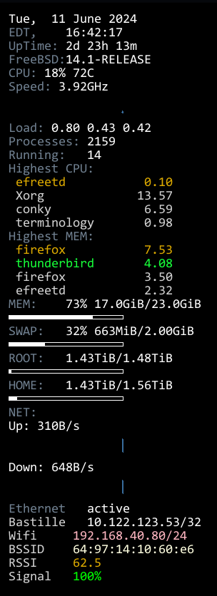

## Another System Status conky that monitors WiFi connection.

This conky is the "traditional" script that has been extended to montior WiFi connection strenght, SSID, and BSSID amongst other gauges. 

 

## This conky includes a simple script to display signal levels as a percentage

```sh
#!/bin/sh

RSSI=$(ifconfig wlan0 list status | awk 'NR==2 {print $5}' | head -1)
RSSI_FLOAT=$(echo "$RSSI" | bc -l)

if [ $(echo "$RSSI_FLOAT >= 90" | bc -l) -eq 1 ]; then
  PERCENTAGE=0
elif [ $(echo "$RSSI_FLOAT >= 50" | bc -l) -eq 1 ]; then
  PERCENTAGE=100
else
  PERCENTAGE=$(echo "scale=2; (100 - (90 - $RSSI_FLOAT))" | bc)
fi

echo "$PERCENTAGE%"

#This script will calculate the percentage based on the RSSI value with decimal points and provide the expected results
```

## Data is compiled from through this script:

```sh
#!/bin/sh

# Get the directory where the script is located
SCRIPT_DIR=$(dirname "$(readlink -f "$0")")

while true; do
  wpa_cli status | grep "ip_address" | awk '{ sub("ip_address=", "", $1); print $1 }' > /tmp/wifi_ip
  bssid=$(wpa_cli status | grep "bssid=" | awk '{ sub("bssid=", "", $1); print $1 }')

  # Check if BSSID is not empty
  if [ -n "$bssid" ]; then
    printf "%s" "$bssid" > /tmp/wifi_bssid
  fi

  "$SCRIPT_DIR/__wifi_strength_ifconfig.sh" > /tmp/wifi_signal_strength

  #curl -s ifconfig.me > /tmp/public_ip

  sleep 1

  # Write the output of the command to the named pipe
  "$SCRIPT_DIR/__wifi_strength_ifconfig.sh" > /tmp/wifi_output &

  sleep 5
done
```