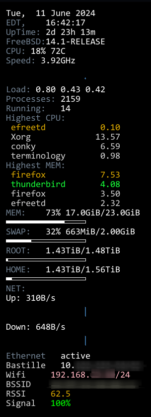

## Another System Status conky that monitors WiFi connection.

This conky is the "traditional" script that has been extended to montior WiFi connection strenght, SSID, and BSSID amongst other gauges. 

 